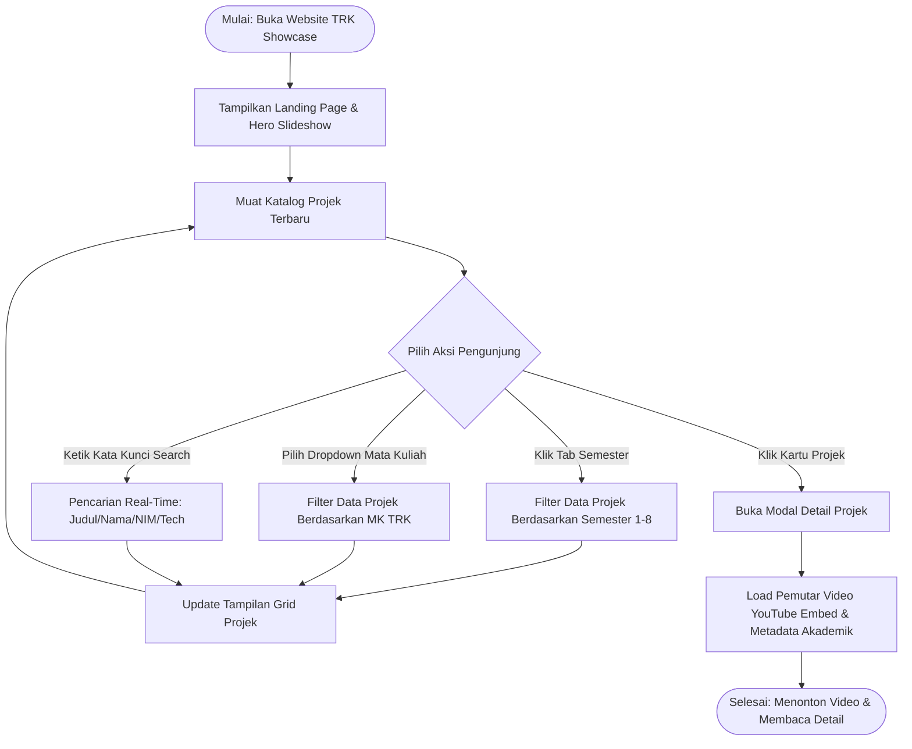
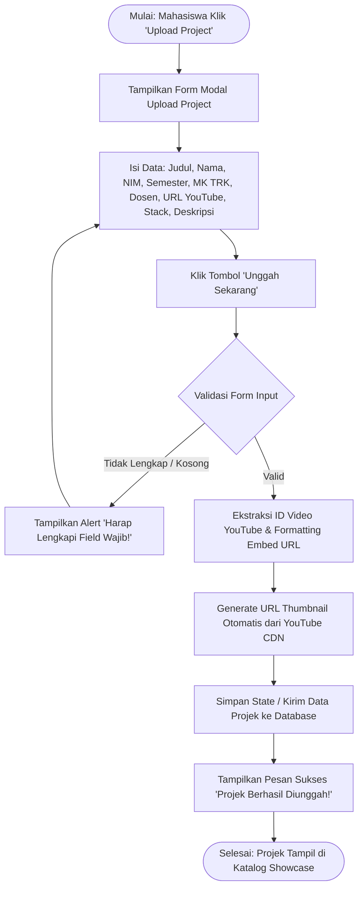
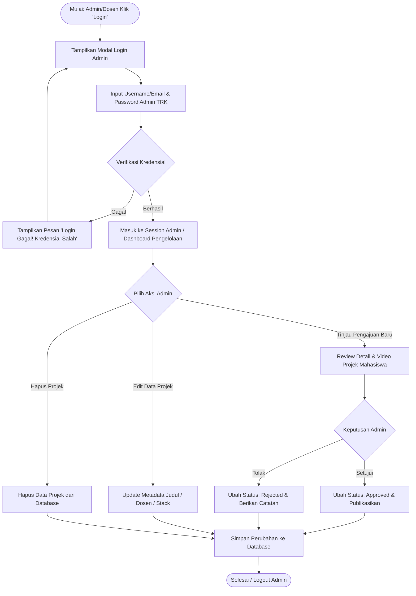

# DOKUMEN PERANCANGAN SISTEM INFORMASI
## Pengelolaan & Showcase Projek Mata Kuliah Program Studi TRK (Teknologi Rekayasa Komputer)
### Sekolah Vokasi IPB University

---

### 📋 Informasi Proyek

* **Nama Sistem**: Sistem Informasi Pengelolaan & Showcase Projek Mata Kuliah TRK SV IPB
* **Program Studi**: Teknik Komputer / Teknologi Rekayasa Komputer (TRK)
* **Instansi**: Sekolah Vokasi IPB University
* **Tim Perancang**: Fatir Syaiful Bahri & Fadillah Nurwahid Mursid
* **Tanggal Perancangan**: 6 Agustus 2026

---

## 1. Daftar Kebutuhan Sistem (Requirements Specification)

### 1.1 Kebutuhan Fungsional (Functional Requirements)

| Kode | Modul / Fitur | Deskripsi Kebutuhan Fungsional | Akses User |
| :---: | :--- | :--- | :---: |
| **FR-01** | **Eksplorasi Katalog Projek** | Sistem harus dapat menampilkan katalog video projek mahasiswa TRK berdasarkan semester (1–8) dan mata kuliah spesifik. | Publik / Mahasiswa |
| **FR-02** | **Pencarian Real-Time** | Sistem menyediakan fitur *Search Bar* untuk mencari projek berdasarkan Judul, Nama Mahasiswa, NIM, atau Teknologi (*Tech Stack*). | Publik / Mahasiswa |
| **FR-03** | **Filter Mata Kuliah TRK** | Sistem menyediakan dropdown penyaringan mata kuliah TRK (IoT, Mikrokontroler, Jaringan Komputer, Cloud Computing, dsb.). | Publik / Mahasiswa |
| **FR-04** | **Pemutar Video Interaktif** | Sistem menyediakan *Modal Detail Projek* dengan pemutar video YouTube (16:9) serta metadata akademik lengkap. | Publik / Mahasiswa |
| **FR-05** | **Pengajuan Projek (Submission)** | Sistem menyediakan formulir upload projek digital bagi mahasiswa untuk mengirimkan metadata projek dan URL video YouTube. | Mahasiswa |
| **FR-06** | **Auto-Generate Thumbnail** | Sistem secara otomatis meng-ekstraksi ID video YouTube dan menampilkan thumbnail kualitas tinggi (*HQ Thumbnail*) dari YouTube CDN. | Sistem |
| **FR-07** | **Autentikasi Admin / Dosen** | Sistem menyediakan fitur Login Modal yang aman bagi Admin/Dosen Pembimbing prodi TRK. | Admin / Dosen |
| **FR-08** | **Dashboard Moderasi Projek** | Admin/Dosen dapat meninjau (*review*), menyetujui (*approve*), menolak (*reject*), mengedit, atau menghapus data pengajuan projek. | Admin / Dosen |

---

### 1.2 Kebutuhan Non-Fungsional (Non-Functional Requirements)

| Kode | Parameter | Spesifikasi & Indikator Kinerja |
| :---: | :--- | :--- |
| **NFR-01** | **Performance & Speed** | Waktu muat awal (*Page Load Time*) < 2.0 detik. Penyimpanan video di-embed dari YouTube CDN untuk menghemat bandwidth server kampus. |
| **NFR-02** | **Responsivitas (Mobile-First)** | Antarmuka menyesuaikan secara sempurna di perangkat Mobile (360px+), Tablet, dan Desktop (1920px+). |
| **NFR-03** | **Keamanan & Validasi Input** | Sanitasi input form ketat, otomatisasi konversi URL YouTube ke format aman `embed/`, serta autentikasi sesi admin. |
| **NFR-04** | **Usability & Aesthetic (UI/UX)** | Menggunakan skema warna resmi IPB (Navy `#003366`, Accent Blue `#2563eb`, Sky Blue `#93c5fd`), mikro-animasi halus, dan kontras font sesuai standar WCAG. |
| **NFR-05** | **Reliability & Availability** | Sistem siap beroperasi 24/7 dengan arsitektur SPA (Single Page Application) React yang ringan dan stabil. |

---

## 2. Perancangan UI/UX (UI/UX Architecture & Layouts)

### 2.1 Identitas Visual & Design System

* **Skema Warna Utama**:
  * `Primary Navy` (`#003366` / `#002244`): Warna dasar resmi Sekolah Vokasi IPB.
  * `Accent Blue` (`#2563eb` / `#60a5fa`): Warna aksen interaktif (Button primary, link hover, active tabs).
  * `Official Sky` (`#38bdf8` / `#93c5fd`): Aksen teks highlight & badge khusus TRK.
  * `Background Light` (`#f8fafc` / `#f1f5f9`): Latar belakang bersih untuk katalog produk.
* **Tipografi**:
  * Heading: `Plus Jakarta Sans` / `Outfit` / `Inter` (Sans-serif modern, bold).
  * Body: `Inter` / System Sans-serif (Legibilitas tinggi).
* **Komponen & Micro-Interactions**:
  * Glassmorphic header navbar dengan efek blur.
  * Hover zoom & play-button overlay pada thumbnail video projek.
  * Carousel slideshow otomatis pada Hero section.

---

### 2.2 Arsitektur Halaman & Layout Wireframe

#### A. Header Navbar (Navigasi Atas)
```
[ LOGO RESMI SV IPB | TRK ]        Home   Tentang   Mata Kuliah   Semester   Project      [🔑 Login]  [📤 Upload Project]
```

#### B. Hero Slideshow Section
```
+-----------------------------------------------------------------------------------------------------------------------+
|  [BADGE: TEKNOLOGI REKAYASA KOMPUTER (TRK)]                                                                            |
|  TRK Student Project Showcase                                                                                         |
|  Platform showcase video projek akhir & praktikum sistem tertanam mahasiswa TRK SV IPB.                                |
|                                                                                                                       |
|  [ Lihat Semua Project -> ]   [ Upload Project 📤 ]                                    ( < )  o  ( - )  o  ( > )      |
+-----------------------------------------------------------------------------------------------------------------------+
```

#### C. Stats Bar Section (Ringkasan Indikator)
```
+-----------------------------+-----------------------------+-----------------------------+
|    📁 250+                  |    👥 450+                  |    🎓 85+                   |
|    TOTAL PROJECTS           |    STUDENTS                 |    TUTORS                   |
+-----------------------------+-----------------------------+-----------------------------+
```

#### D. Controls Bar (Semester Tabs, Search & Dropdown Filter)
```
[ Semua ] [ Sem 1 ] [ Sem 2 ] [ Sem 3 ] [ Sem 4 ] [ Sem 5 ] [ Sem 6 ] [ Sem 7 ] [ Sem 8 ]

[ 🔍 Cari judul, mahasiswa, atau stack...           ]   [ Filter Mata Kuliah TRK ▾ ]
```

#### E. Projects Grid Section (Katalog Kartu Projek TRK)
```
+------------------------------------+  +------------------------------------+  +------------------------------------+
| [ Thumbnail YouTube Auto ] [Sem 4] |  | [ Thumbnail YouTube Auto ] [Sem 3] |  | [ Thumbnail YouTube Auto ] [Sem 5] |
| (▶ Play Overlay)                   |  | (▶ Play Overlay)                   |  | (▶ Play Overlay)                   |
+------------------------------------+  +------------------------------------+  +------------------------------------+
| Sistem IoT Smart Farming ESP32     |  | Sistem Akses Lab RFID & Biometrik  |  | Aplikasi Mobile Smart Home         |
| By Ahmad Rizky Pratama (J0304...)  |  | By David Chen (J0304211029)        |  | By Nabila Putri Utami (J0304...)   |
| [INTERNET OF THINGS & EMBEDDED]    |  | [SISTEM KONTROL & MIKROKONTROLER]  |  | [PEMROGRAMAN PERANGKAT TERHUBUNG]  |
| [ESP32] [MQTT] [NodeJS] [Chart.js] |  | [Arduino] [RFID] [Raspberry Pi]    |  | [Flutter] [Firebase] [ESP8266]     |
| [ View Details ]                   |  | [ View Details ]                   |  | [ View Details ]                   |
+------------------------------------+  +------------------------------------+  +------------------------------------+
```

#### F. Modal Detail Projek (Pop-up Player & Metadata)
```
+--------------------------------------------------------------------------------------------------+  (X)
|                                                                                                  |
|   +------------------------------------------------------------------------------------------+   |
|   |                                                                                          |   |
|   |                       [ PEMUTAR VIDEO YOUTUBE EMBED (16:9) ]                             |   |
|   |                                                                                          |   |
|   +------------------------------------------------------------------------------------------+   |
|                                                                                                  |
|   Judul Projek: Sistem IoT Smart Farming & Monitoring Sensor ESP32                               |
|   👤 Ahmad Rizky Pratama (J0304211088)  •  🎓 TRK SV IPB  •  📅 Tahun 2025/2026                   |
|                                                                                                  |
|   +------------------------------------------------------------------------------------------+   |
|   | MATA KULIAH: INTERNET OF THINGS & EMBEDDED SYSTEM   | DOSEN: Prof. Dr. Ir. Kudang B.    |   |
|   +------------------------------------------------------------------------------------------+   |
|                                                                                                  |
|   Deskripsi Projek:                                                                              |
|   Projek IoT & embedded system karya mahasiswa TRK Sekolah Vokasi IPB untuk memantau             |
|   kelembaban tanah dan suhu lingkungan greenhouse SV IPB Sukabumi...                             |
|                                                                                                  |
|   Teknologi Yang Digunakan: [ESP32] [MQTT] [NodeJS] [Chart.js]                                   |
+--------------------------------------------------------------------------------------------------+
```

#### G. Modal Upload Project (Form Pengajuan Mahasiswa)
```
+--------------------------------------------------------------------------------------------------+  (X)
| Upload Video Project Semester TRK                                                                |
|                                                                                                  |
| Judul Project Video *    : [ Contoh: Sistem Monitoring Kebun Cerdas IoT ESP32                  ] |
| Nama Mahasiswa *        : [ Contoh: Ahmad Rizky                                              ] |
| NIM Mahasiswa *         : [ Contoh: J0304211088                                              ] |
| Program Studi           : [ Teknik Komputer / TRK ▾                                          ] |
| Semester & Mata Kuliah  : [ Semester 4 ▾ ] [ INTERNET OF THINGS & EMBEDDED SYSTEM ▾              ] |
| Dosen Pembimbing        : [ Nama Dosen beserta Gelar                                         ] |
| URL Video YouTube *     : [ https://www.youtube.com/watch?v=...                              ] |
| Teknologi / Stack       : [ ESP32, MQTT, NodeJS, React                                       ] |
| Deskripsi Project       : [ Ringkasan latar belakang, solusi hardware/software, dan hasil... ] |
|                                                                                                  |
|                                                               [ Batal ]  [ 📤 Unggah Sekarang ]  |
+--------------------------------------------------------------------------------------------------+
```

---

## 3. Alur Sistem (System Flowchart Diagrams)

### 3.1 Flowchart 1: Pengunjung / Mahasiswa (Eksplorasi & Filter Projek)



---

### 3.2 Flowchart 2: Mahasiswa (Pengajuan / Upload Projek Baru)



---

### 3.3 Flowchart 3: Admin / Dosen Pembimbing (Moderasi & Pengelolaan Data)



---

## 4. Matriks Ringkasan & Langkah Selanjutnya

| No | Modul Perancangan | Status Perancangan | Keterangan Tambahan |
| :---: | :--- | :---: | :--- |
| 1 | **Spesifikasi Kebutuhan (SRS)** | ✅ Disetujui | Mencakup 8 Kebutuhan Fungsional & 5 Non-Fungsional. |
| 2 | **Perancangan UI/UX & Wireframe** | ✅ Disetujui | Sesuai Identitas SV IPB & khusus prodi TRK. |
| 3 | **Flowchart System & Mermaid Diagram** | ✅ Disetujui | 3 Alur utama: Eksplorasi, Submission, & Admin Moderasi. |

---
*Dokumen ini dibuat sebagai acuan resmi perancangan awal sebelum pengembangan teknis Sistem Informasi Pengelolaan Mata Kuliah & Showcase Projek Mahasiswa TRK Sekolah Vokasi IPB University.*
